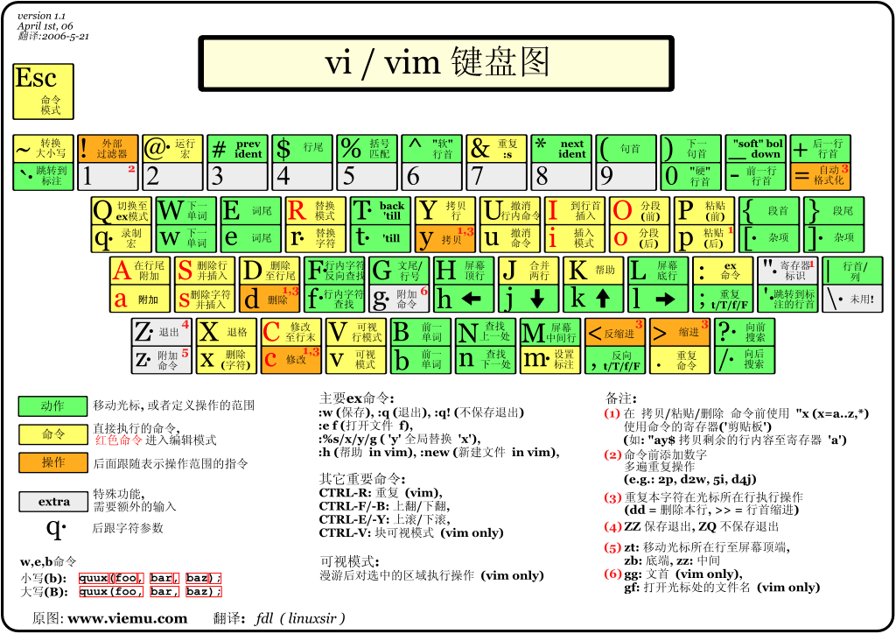

# vim-manual

## 1. 什么是 vim

### 1.1 vim 简介

vim 是每个 Linux 系统自带的编辑器，简洁高效，功能强大。

vim 特点：

-   所有 UNIX Like 系统都默认内置 vim
-   很多软件编辑接口都会调用 vi/vim
-   具有强大的程序编辑能力和丰富的插件

### 1.2 vim 安装

## 2. vim 小白

在终端输入 vim [file]即进入 vim 环境。如果 file 不存在，vim 会自动创建名为 file 的文件；如果不带任何参数，就需要在保存时指定文件名。

### 2.1 vim 模式

vim 分为三种模式：一般模式、编辑模式及命令模式。

-   命令模式
    在一般模式下，可以移动光标，进行删除、复制、粘贴操作，但无法编辑文件内容。

-   插入模式
    在一般模式下按“i,I,o,O,a,A,[插入]r,R[替换]”任何一个字符即进入编辑模式，通常终端底部会出现--INSERT--字样，此时可以对文件进行编辑。

-   命令模式
    在一般模式下按“:,/,?”任何一个字条即进入命令行模式，可以将光标移动到最下一行,可以进行读取、保存、替换、退出等操作。

### 2.2 vim 简单操作

在 vim 的一般模式下，所有的键就是功能键。

1. 进入编辑

    在终端输入 vim [file]即进入 vim 环境。如果 file 不存在，vim 会自动创建名为 file 的文件；如果不带任何参数，就需要在保存时指定文件名。

2. 简单移动光标

    |     |                                         |
    | --- | --------------------------------------- |
    | 0   | 移动至行头                              |
    | ^   | 移动至本行第一个不是 blank 字符的位置   |
    | $   | 移动至本行尾                            |
    | g\_ | 移动至本行最后一个不是 blank 字符的位置 |

3. 复制/粘贴/删除

    |     |               |
    | --- | ------------- |
    | yy  | 复制当前行    |
    | nyy | 向下复制 n 行 |
    | p   | 粘贴至下一行  |
    | P   | 粘贴至上一行  |
    | dd  | 删除当前行    |

4. 重复/撤销/搜索

    |          |                        |
    | -------- | ---------------------- |
    | u        | 撤销                   |
    | [Ctrl]+r | 重复                   |
    | /string  | 向前查找 string 字符串 |
    | ?string  | 身后查找 string 字符串 |

5. 打开/保存/退出

    |                        |                  |
    | ---------------------- | ---------------- |
    | :e \<path/to/file\>    | 打开 file 文件   |
    | :w                     | 保存             |
    | :saves\<path/to/file\> | 另存为 file 文件 |
    | :x                     | 保存并退出       |
    | ZZ                     |                  |
    | :wq                    |                  |
    | :q                     | 不保存退出       |
    | :q!                    | 强制退出         |

## 3. vim 高手

### 3.1 光标移动命令

|          |                        |
| -------- | ---------------------- |
| h        | 向左移动一个字符       |
| j        | 向右移动一个字符       |
| k        | 向上移动一个字符       |
| l        | 向下移动一个字符       |
| Ctrl + f | 屏幕向下移动一页       |
| Ctrl + b | 屏幕向上移动一页       |
| Ctrl + d | 屏幕向下移动半页       |
| Ctrl + u | 屏幕向上移动半页       |
| 0/[Home] | 移动到一行最前面字符处 |
| $/[End]  | 移动到一行最后面字符处 |
| G        | 移动到文件最后一行     |
| nG       | 移动到文件的第 n 行    |
| gg       | 移动到文件的第一行     |

### 3.2 操作命令

1. 删除

    |     |                             |
    | --- | --------------------------- |
    | x   | x 为向后删除一个字符[Del]   |
    | X   | 向前删除一个字符[Backspace] |
    | dd  | 删除光标所在行              |
    | ndd | 删除光标位置向下的 n 行     |

2. 复制

    |     |                                |
    | --- | ------------------------------ |
    | yy  | 复制光标所在行                 |
    | nyy | 复制光标位置向下的 n 行        |
    | y1G | 复制所在行到第 1 行的数据      |
    | yG  | 复制光标所在行到最后一行的数据 |

3. 粘贴

    |     |                                        |
    | --- | -------------------------------------- |
    | p   | 将已复制数据粘贴在光标所在位置的下一行 |
    | P   | 将已复制数据粘贴在光标所在位置的上一行 |

4. 操作

    |          |                |
    | -------- | -------------- |
    | u        | 撤销前一个操作 |
    | Ctrl + r | 重做上一个操作 |
    | .        | 重复前一个操作 |

### 3.3 模式切换

1. 一般模式与编辑模式

    |     |                                                 |
    | --- | ----------------------------------------------- |
    | i   | 插入模式，从光标所在处开始插入                  |
    | I   | 插入模式，从所在行第一个非空格符处开始插入      |
    | a   | 插入模式，从光标所在下一个字符处开始插入        |
    | A   | 插入模式，从光标所在行的最后一个字符处开始插入  |
    | o   | 插入模式，在光标所在行的下一行处插入新的一行    |
    | O   | 插入模式，在光标所在行的上一行处插入新的一行    |
    | r   | 替换模式，只替换光标所在的字符一次              |
    | R   | 替换模式，一直替换光标所在字符，直到按下 Esc 止 |

2. 一般模式与命令模式

    |              |                                                          |
    | ------------ | -------------------------------------------------------- |
    | :w           | 将数据写入硬盘文件                                       |
    | :w!          | 文件为“只读”时，强制写入文件[是否成功与对文件的权限有关] |
    | :w[filename] | 文件另存为 filename                                      |
    | :q           | 退出                                                     |
    | :q!          | 强制退出[不保存文件]                                     |
    | :wq          | 保存后退出                                               |
    | :wq!         | 强制保存后退出                                           |
    | ZZ           | 若文件未更改，则不保存离开；若文件更改，则保存后离开     |

### 3.4 vim 的保存、恢复与打开时的警告信息

vim 的工作被不正常中断，导致暂存盘无法通过正常流程结束，暂存文件就不会消失，可通过该文件恢复数据。

暂存盘警告信息参数：

|                    |                                                    |
| ------------------ | -------------------------------------------------- |
| [`O`]pen Read-Only | 打开文件成为只读文件，常用于查阅文件而不进行编辑时 |
| (`E`)dit anyway    | 正常方式打开要编辑的文件，并不会载入暂存文件内容   |
| (`R`)ecover:       | 加载暂存文件内容                                   |
| (`D`)elete it      | 删除暂存文件                                       |
| (`Q`)uit           | 退出 vim                                           |
| (`A`)bort          | 忽略编辑行为                                       |

## 4. vim 超能力

### 4.1 vim 配置

1. [vim 基本配置](vimrcs/vimrc_basic.vim)
2. [vim 插件配置](vimrcs/plugins_config.vim)

### 4.1 块操作

|            |                                |
| ---------- | ------------------------------ |
| v          | 字符选择                       |
| V          | 行选择                         |
| [Ctrl] + v | 块选择                         |
| [Ctrl] + d | 向下移动                       |
| y          | 复制所选择区域                 |
| d          | 删除所选择区域                 |
| J          | 把所选区域行连接起来(变在一行) |
| \</\>      | 左右缩进                       |
| =          | 自动缩进                       |

### 4.2 多文件编辑

|        |                             |
| ------ | --------------------------- |
| :n     | 编辑下一个文件              |
| :N     | 编辑上一个文件              |
| :files | 列出目前 vim 打开的所有文件 |

### 4.3 多窗口功能

|                   |                                                         |
| ----------------- | ------------------------------------------------------- |
| :split            | 创建分屏                                                |
| :vsplit           | 创建垂直分屏                                            |
| :sp[file-name]    | 在新窗口打开新文件                                      |
| [Ctrl] + w + j    | 按键：按下[Ctrl]不放，再按下 w 后放开所有按键，再按下 j |
| [Ctrl] + w + 下键 | 操作：光标移动至下方窗口                                |
| [Ctrl] + w + k    | 操作：光标移动至上方窗口                                |
| [Ctrl] + w + 上键 |                                                         |
| [Ctrl] + w + q    | 退出                                                    |
| [Ctrl] + w + \_   | 最大化尺寸                                              |
| [Ctrl] + w + +    | 增加尺寸                                                |

